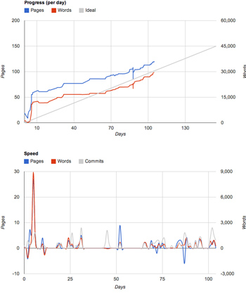

WritingStats: Tracking and Visualizing Writing Progress
=======================================================

WritingStats is a collection of scripts to automatically create statistics
from LaTeX documents and visualize them with an overall progress plots and a
plot of the daily speed of change.

Currently, this project provides a setup for a standard LaTeX environment in
combination with git version tracking.

Features
--------

 - determine page and word count, generate statistics based on them
 - generate RSS feed with the latest data
 - generate graphs to visualize progress

Example
-------

    Goal
    ----

    Words: 52500
    Pages: 150
    Words/Page: ca. 350
    Draft Deadline: 1 September 2012

    Current Status
    --------------

    Words: 29367
    Pages: 119
    Words to be written: 23133
    Pages to be written: ca. 49
    Progress: 55.94% finished
    Remaining Days: 49.21
    Remaining Workdays: 35.15
    Remaining Words/Workday: 658
    Pages/Day: 1.88
    Current Date: Friday, 13. July 2012 18:50:43

 

Setup
-----

WritingStats depends on the following software:

 - PHP, command-line interpreter (any recent version should do)
 
 - LaTeX-Mk, for the Makefile used in the git post-receive hook  
   http://latex-mk.sourceforge.net/
   
 - TeXcount, for the word count, tested with version 3.0  
   http://app.uio.no/ifi/texcount/

 - Google Chart Tools (no installation required, uses online copy)  
   https://developers.google.com/chart/

### Customize Settings

As you have seen in the example above, WritingStats uses a defined goal to
estimate your progress. The goal and other settings are defined in
`status.conf`. You will have to set the file name for your main tex file, and
the name of the log-file LaTeX produces. The log file has typically the same
name but uses the .log-extension.

To achieve accurate results, you will need to estimate the number of words per
page, and how many additional pages the final PDF will contain. Often, you
will want to ignore for instance the table of content, lists of figures and
tables, appendices, etc. Since, we currently do not have a way to detect them
automatically, they will need to be configured instead.

The settings for start date and deadline are necessary to calculate the length
of the project, the number of days left, and to size the charts properly.

Note that the RSS feed needs to be modified separately (cf. below).

### Server Repository

After customizing `status.conf`, we suggest to set up a shared repository on a
server to automatically generate the statistics on every push to the server.
Note, this will require that the server is able to generate the PDF file using
make and LateX-Mk. Furthermore, it will require a installation or local copy
of TeXcount.

To make sure that the post-receive script only executes the code on the
desired server, we do check the hostname of the machine. Please adapt it for
your deployment!

To set up a shared git repository with a post-receive hook, execute the
following steps:

    git init --bare
    git clone --local `pwd` checkout
    ln -s `pwd`/checkout/status/post-receive hooks/post-receive

### RSS Feed

The RSS feed can be published using the `status/status.rss.php` file. It needs
to be adapted to reflect the project properly. The RSS feed has a title,
description, language, and so on. Furthermore, it contains the URLs it
corresponds to. After adapting the file, a typical deployment will use a
symlink to expose the script in a public web server directory. Note, the
script accesses the `status/status.items` file that is automatically generated
as part of the post-receive hook.

History
-------

The foundation of this project was already laid out when I wrote my master
thesis. To track my own progress, I wrote the initial version of these
scripts. However, back then, I was happily using Word and it's XML-based docx
file format. To be able to count words automatically, I used the
`docx2html.xsl` XSLT transformation, which also generated reasonably good HTML
from the Word files. The scripts are currently not adapted to use it, and
thus, Word is not supported anymore. However, pull requests to reintegrate it
are of course welcome.

License
-------

Copyright (c) 2012 Stefan Marr <mail@stefan-marr.de>

Permission is hereby granted, free of charge, to any person obtaining a copy
of this software and associated documentation files (the "Software"), to deal
in the Software without restriction, including without limitation the rights
to use, copy, modify, merge, publish, distribute, sublicense, and/or sell
copies of the Software, and to permit persons to whom the Software is
furnished to do so, subject to the following conditions:

The above copyright notice and this permission notice shall be included in all
copies or substantial portions of the Software.

THE SOFTWARE IS PROVIDED "AS IS", WITHOUT WARRANTY OF ANY KIND, EXPRESS OR
IMPLIED, INCLUDING BUT NOT LIMITED TO THE WARRANTIES OF MERCHANTABILITY,
FITNESS FOR A PARTICULAR PURPOSE AND NONINFRINGEMENT. IN NO EVENT SHALL THE
AUTHORS OR COPYRIGHT HOLDERS BE LIABLE FOR ANY CLAIM, DAMAGES OR OTHER
LIABILITY, WHETHER IN AN ACTION OF CONTRACT, TORT OR OTHERWISE, ARISING FROM,
OUT OF OR IN CONNECTION WITH THE SOFTWARE OR THE USE OR OTHER DEALINGS IN THE
SOFTWARE.

